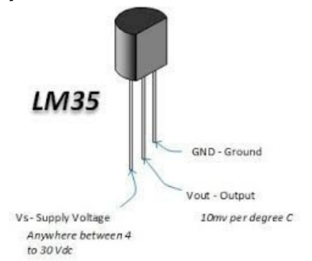

# Control_Temperature_ATMI
In this project proportional control was developed in a heating and cooling system.

The block diagram of the system is shown in figure 1.

## Interface

The system will have a four button interface and a 16x2 LCD display where you can move between screens and make system settings.

## Temperature Sensor

The temperature sensor is the LM35 with output ranging from 10mV / °C.

