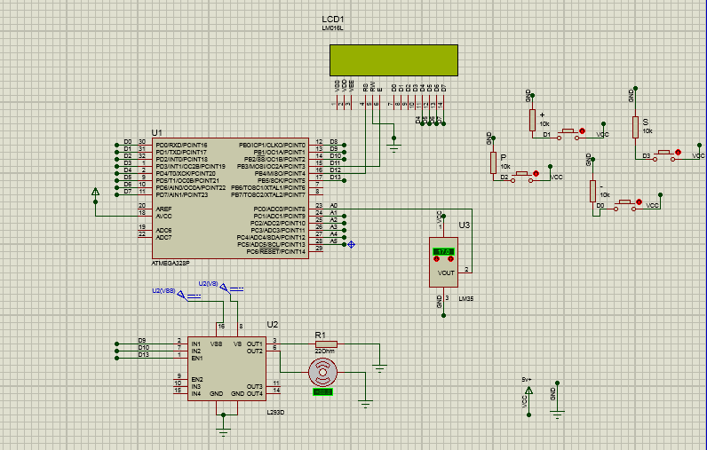

# Control_Temperature_ATMI
In this project proportional control was developed in a heating and cooling system.

# Goal 

Design a temperature control system capable of warming and cooling the environment based on the current temperature and the set temperature. The controller shall be of Proportional type and the outputs for the PWM type drive. A system life led (Heart Beat) should oscillate at 0.5Hz whenever the system is powered and the drive is enabled. If driver is disabled, the LED should remain lit.

# System Block Diagram
The block diagram of the system is shown in figure 1.

## Interface

The system will have a four button interface and a 16x2 LCD display where you can move between screens and make system settings.

## Temperature Sensor

The temperature sensor is the LM35 with output ranging from 10mV / °C.

# MCU

The MCU for simulation was the Atmega328p. This microcontroller was responsible for the control tasks and the system interface.
The schematic of the MCU is shown in next figure.

# Drive

The driver used was the L923D Integrated Circuit - Half-H Quadruple Drivers, pinout shown below,

# Heater

Heating is performed with a 22Ω 1 / 2W resistor.

# Fan

The fan consists of a motor and a propeller, the model used has the following characteristics:
Power: 12 VDC
Current: 130mA

# Heart Beat

An LED should be used to inform that the system is running. The LED should remain lit if the output driver is disabled.

# Controller

The controller used will be of Proportional type, in this controller the error signal, difference between the reference signal and the feedback signal, is multiplied by the proportional gain (Kp) and applied to the output.

The block diagram of the controller is shown below:

# Schematic 

The next figure shows the schematic of the circuit assembly.

